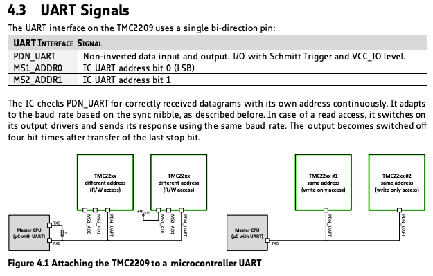

# TMC_2209_ESP32 and Micropython
This is a libary to drive a stepper motor with a TMC2209 stepper driver and a LOLIN32 V1.0.0 ESP32 Board

This is a clone off the great work from Chr157i4n, thank you for the time you spent https://github.com/Chr157i4n/TMC2209_Raspberry_Pi, and a fork of https://github.com/kjk25/TMC2209_ESP32.

This fork supports multiple TMC2209 motor drivers by using the address pins on the motor driver. 

The datasheet is here: https://www.analog.com/media/en/technical-documentation/data-sheets/TMC2209_datasheet_rev1.08.pdf

I had trouble initially understanding this, but eventually I got it. This code helped https://github.com/anonymousaga/TMC2209_RPI_PICO

If you wire your UART TX to both UART pins on the two TMC2209 controllers, then you can change the address of each by wiring MS1 and/or MS2 to Vccio (your board power pin, NOT THE MOTOR PIN). The two pins form a binary address.

| MS2 | MS1 | Address |
|-----|-----|--------|
|  0  |  0  |    0   |
|  0  |  1  |    1   |
|  1  |  0  |    2   |
|  1  |  1  |    3   |

This code is still experimental, so use it on your own risk.
i have not tested all functions, hope its a start for others.

